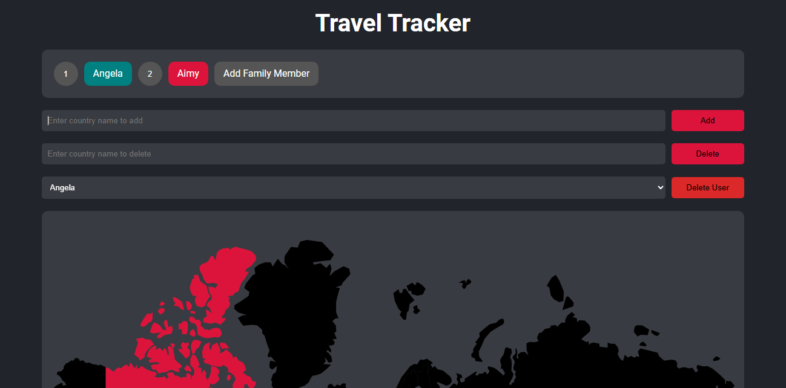

# Family Travel Project ✈️🌍



## Table of Contents

- [Introduction](#introduction)
- [Features](#features)
- [Technologies Used](#technologies-used)
- [Setup](#setup)
- [Usage](#usage)
- [Routes](#routes)
- [Database Schema](#database-schema)

## Introduction

The Family Travel Project is a web application designed to help users keep track of the countries they have visited. Users can add, delete, and manage countries and users, making it easy to track travel progress for multiple family members.

## Features

- 🆕 Add new users (family members)
- 🔄 Select a user to view their visited countries
- ➕ Add and ➖ delete countries for each user
- 🌐 Responsive design with a dark color scheme

## Technologies Used

- 🟢 Node.js
- ⚙️ Express.js
- 🐘 PostgreSQL
- 📝 EJS (Embedded JavaScript templating)
- 🌐 HTML/CSS
- 📜 JavaScript

## Setup

### Prerequisites

- Node.js and npm installed
- PostgreSQL installed and running

### Installation

1. Clone the repository:
   ```bash
   git clone https://github.com/Umairulislam/family-travel-tracker.git
   cd family-travel-tracker
   ```
2. Install dependencies:
   ```bash
   npm install
   ```
3. Set up the PostgreSQL database:

   ```sql
   CREATE DATABASE world;
   \c world
   CREATE TABLE users (
   id SERIAL PRIMARY KEY,
   name VARCHAR(100) NOT NULL,
   color VARCHAR(50) NOT NULL
   );
   CREATE TABLE countries (
   country_code VARCHAR(10) PRIMARY KEY,
   country_name VARCHAR(100) NOT NULL
   );
   CREATE TABLE visited_countries (
   id SERIAL PRIMARY KEY,
   user_id INT REFERENCES users(id),
   country_code VARCHAR(10) REFERENCES countries(country_code)
   );

   ```

4. Add your database credentials to index.js or create a .env file with the following variables:

   ```bash
    DB_USER=your_username
    DB_HOST=localhost
    DB_NAME=world
    DB_PASSWORD=your_password
    DB_PORT=5432
   ```

5. Start the server:

   ```bash
   nodemon index.js
   ```

6. Visit http://localhost:3000 in your browser.

## Usage

### Adding a Family Member

- Click on the "Add Family Member" button on the main page.
- Fill in the user details and click "Submit".

### Adding a Country

- Enter the country name in the "Enter country name" input field and click "Add".

### Deleting a Country

- Enter the country name in the "Enter country name to delete" input field and click "Delete".

### Deleting a User

- Select the user from the dropdown and click "Delete User".

## Routes

### GET /

- Renders the main page with user and country information.

### POST /add

- Adds a new country for the current user.

### POST /delete

- Deletes a country for the current user.

### POST /deleteUser

- Deletes a user and all associated visited countries.

## Database Schema

### users

| Column | Type    | Constraints |
| ------ | ------- | ----------- |
| id     | SERIAL  | PRIMARY KEY |
| name   | VARCHAR | NOT NULL    |
| color  | VARCHAR | NOT NULL    |

### countries

| Column       | Type    | Constraints |
| ------------ | ------- | ----------- |
| country_code | VARCHAR | PRIMARY KEY |
| country_name | VARCHAR | NOT NULL    |

### visited_countries

| Column       | Type    | Constraints                        |
| ------------ | ------- | ---------------------------------- |
| id           | SERIAL  | PRIMARY KEY                        |
| user_id      | INT     | REFERENCES users(id)               |
| country_code | VARCHAR | REFERENCES countries(country_code) |
